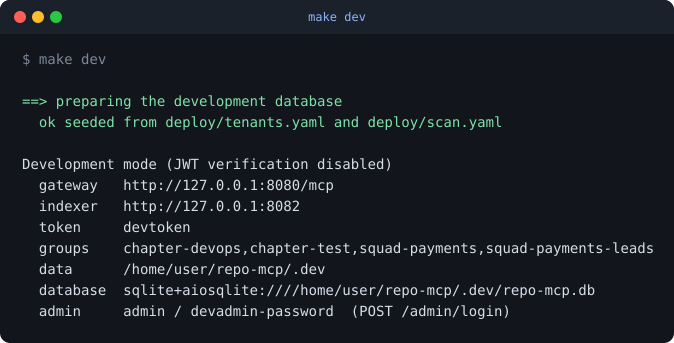
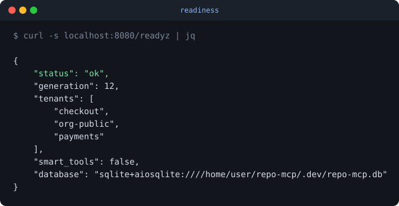
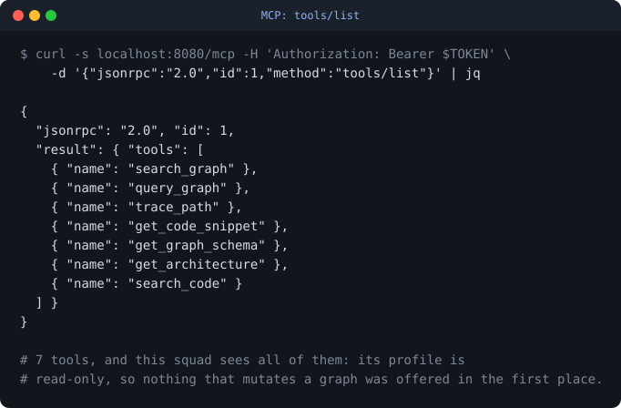
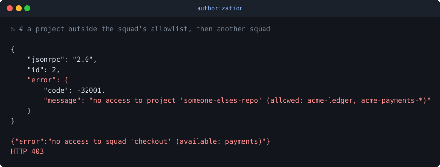
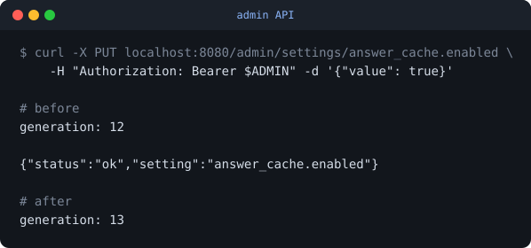

# repo-mcp

**One code intelligence service for the whole company.** Point it at a GitHub
org, a GitLab group or a Bitbucket workspace, and every repo underneath turns
into one queryable graph. Coding agents, chatbots and CI pipelines connect to
it over MCP.

Version 0.1.0 · [Türkçe](README.md) (primary) · [Changelog](CHANGELOG.md)

---

You ask "who calls this function?", "what breaks if I change this?", "which
services hit this endpoint?" — and the answer is computed from the code, not
guessed from a context window.

It runs as a service: LDAP login, per-squad isolation, role-based permissions,
automatic repo discovery, audit logs, and an LLM layer that goes through your
own [LiteLLM](https://github.com/BerriAI/litellm) proxy. You pick the model —
a hosted one, your own vLLM, or Ollama.

## Why

Code intelligence tools are built for one developer on one laptop. That does
not hold at company scale: everyone reindexes the same repos, no graph is ever
shared between teams, cross-service questions cannot be answered at all, and
none of it is reachable from a bot or a CI job.

repo-mcp turns it into a shared service. Indexed once, centrally, with the
access control a company actually needs.

## What it does

- **Finds repos on its own.** One connector per GitHub org, GitLab group
  (nested subgroups included) or Bitbucket workspace, filtered with patterns.
  A new repo is picked up without touching any config.
- **Keeps the graph current, four ways.** Verified push webhooks, a periodic
  scan, a CI trigger, and manual reindexing.
- **Speaks MCP over HTTP.** Claude Code, Cursor, Copilot, a bot, a pipeline —
  any MCP client connects to one endpoint with an OIDC token.
- **Gets identity from LDAP.** Active Directory or OpenLDAP, through Keycloak.
  repo-mcp keeps no user table of its own.
- **Separates squads, in three independent layers.** Role permissions and a
  project list at the gateway, a closed-by-default tool profile inside the
  engine, a separate directory per squad on disk. A mistake in one does not
  open the others.
- **Answers in plain text when that helps.** It summarises the impact of a
  change and answers questions in natural language — but it always queries the
  graph first. The model is never asked to guess the graph.
- **Writes every call to an audit log**, refusals included. Reading a snippet
  means reading real source code.

## Architecture

```
 Agent · Bot · CI ──MCP / HTTP + OIDC──▶ Gateway ──▶ engine (one per squad)
                                            │
                                            └──HTTPS──▶ LiteLLM ──▶ model

 GitHub · GitLab · Bitbucket ──webhook / schedule──▶ Indexer ──▶ graph
```

Two services and a database.

The **gateway** authenticates, checks permissions and serves MCP.
The **indexer** finds repos and keeps their graphs up to date.
**PostgreSQL** holds the settings: squads, roles, connectors, preferences and
encrypted provider tokens. An admin changes them through an API while the
platform runs — no restart.

Details: [docs/architecture.md](docs/architecture.md).

## Quick start

```bash
git clone https://github.com/emrezdemir/repo-mcp
cd repo-mcp

make setup      # venvs, dependencies, config files, generated secrets
# put a provider token in deploy/.env, edit deploy/scan.yaml
make up         # bring up the Docker stack
make smoke      # check it end to end
```

Then start discovery and indexing:

```bash
source deploy/.env
curl -X POST http://localhost:8082/rescan -H "Authorization: Bearer $CI_TRIGGER_TOKEN"
curl http://localhost:8082/repos
```

Point your MCP client at `http://localhost:8080/mcp` with an OIDC token and an
`X-Tenant` header. The full walkthrough, Keycloak and LDAP included, is in
[docs/deployment.md](docs/deployment.md).

If something does not work, run `make debug`. It checks the toolchain, the
engine, the config, storage, both services, a live MCP call and the model side.
It does not stop at the first problem — it reports everything it finds.

## Settings

Settings live in PostgreSQL. You change them through the admin API or
`repo-mcp-admin`, not by editing files. The environment only carries what has
to be known before the database can be read: `DATABASE_URL`, `SECRETS_KEY` and
the engine paths.

The two formats below are what both the importer and the API accept.

Who may do what, to which data:

```yaml
roles:
  admin:     [platform-admins]
  developer: [squad-payments]
  devops:    [chapter-devops]

tenants:
  payments:
    ldap_groups: [squad-payments, chapter-devops]
    tool_profile: analysis          # read-only engine profile
    projects: ["acme-payments-*", "acme-ledger"]
```

What to index:

```yaml
connectors:
  - name: acme-github
    type: github
    org: acme
    token_env: GITHUB_TOKEN
    tenant: payments
    include: ["payments-*"]
    exclude: ["*-archive"]
    mode: moderate
```

## What it looks like

There is no web interface — an MCP endpoint, an admin API and health
endpoints. These come from a running instance and are regenerated with
`make screenshots`.

Bringing it up: schema, settings and the first admin, in one command.



The gateway tells you which squads are loaded and which config generation it
is on.



An MCP call: the client lists tools and sees whatever its permissions allow.



An unauthorized request does not come back empty — it is refused with the
reason.



You change a setting through the admin API, the generation number goes up, and
every replica picks up the new value without a restart.



## Documentation

| | |
| --- | --- |
| [Architecture](docs/architecture.md) | components, data flow, what is not built yet |
| [Roles and permissions](docs/roles-and-permissions.md) | permissions, roles, chapters |
| [Deployment](docs/deployment.md) | Keycloak/LDAP, webhooks, CI, production notes |
| [Environments](docs/environments.md) | how a branch becomes something running |
| [Scaling](docs/scaling.md) | storage options, what to watch, capacity |
| [Development](docs/development.md) | the scripts, the test layers, debugging |
| [Code standards](docs/code-standards.md) | code, test and documentation rules |
| [Branching](docs/branching.md) | main/dev flow, keeping secrets out of the repo |
| [Indexing engine](docs/engine.md) | what the engine does, and the limits it brings |
| [Roadmap](docs/roadmap.md) | done, next, and explicitly not planned |
| [Decision records](docs/adr/) | why the design is what it is |

## Status

Early — version 0.1.0.

The gateway and the indexer work and have tests. The web UI and graph history
are designed but not built. Provider discovery, webhooks and the LLM layer are
written and unit-tested, but have never run against a real GitHub org, a live
LiteLLM proxy or Keycloak.

[docs/roadmap.md](docs/roadmap.md) and
[memory-bank/progress.md](memory-bank/progress.md) say plainly what is in which
state. Look there before assuming a feature exists.

## Development

```bash
make setup      # venvs and dependencies
make test       # lint and unit tests for both services
make dev        # run both services locally, no Docker, auto-reload
make debug      # find whatever is not working
make verify     # the check to pass before calling anything finished
make help       # the rest
```

Every target is a script under [`scripts/`](scripts/) — run them directly if
you prefer. Details in [docs/development.md](docs/development.md).

For Kubernetes there is a chart in
[`deploy/helm/repo-mcp`](deploy/helm/repo-mcp). Read
[docs/scaling.md](docs/scaling.md) before raising any replica count — the
storage layout limits it.

The version lives in one file, [`VERSION`](VERSION). `scripts/version.sh`
spreads it to the packages and the chart, and `make verify` checks that they
all still agree.

Contributions welcome: [CONTRIBUTING.md](CONTRIBUTING.md).

## Licence

MIT — [LICENSE](LICENSE).

repo-mcp bundles a third-party indexing engine. Its licence and attribution
are in [NOTICE](NOTICE).
