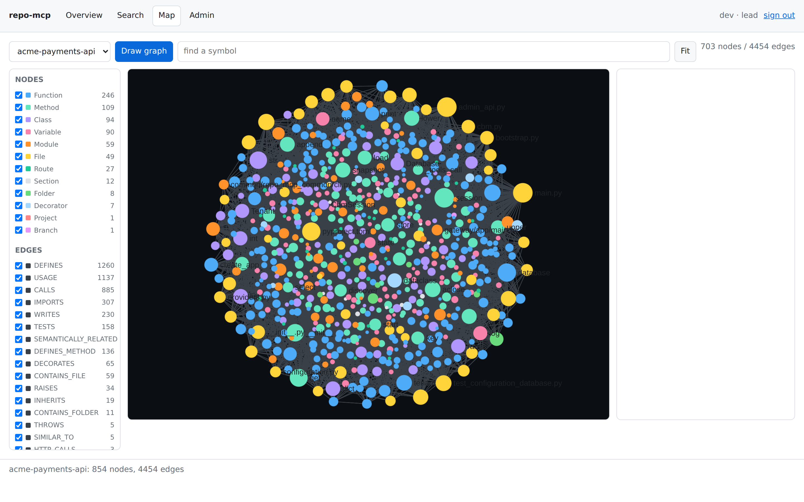

# repo-mcp

A service that centrally indexes repositories on GitHub, GitLab and Bitbucket
and exposes the resulting code graph over MCP.

Version 0.2.0 · [Türkçe](README.md) (primary) · [Changelog](CHANGELOG.md)

## Overview

When a GitHub organisation, GitLab group or Bitbucket workspace is defined as
a connector, the repositories in scope are discovered, cloned and indexed. The
indexing itself is done by an embedded engine; the result is stored on disk as
one graph file per project.

Access to that graph goes through MCP (Model Context Protocol), as JSON-RPC
over HTTP. Coding agents, internal chatbots and CI pipelines connect to the
same endpoint. Requests are authenticated with an OIDC token, and LDAP group
membership is mapped to a role and a squad.

The system consists of two services and a database. The gateway handles
authentication, authorization and the MCP surface. The indexer discovers
repositories and keeps their graphs up to date. PostgreSQL holds the
configuration, which can be changed while the platform runs.

## Usage examples

The questions an MCP client can ask correspond to the tools the engine
exposes:

- Find what calls a symbol or depends on it: `search_graph`, `trace_path`
- Extract the overall shape of a project: `get_architecture`,
  `get_graph_schema`
- Run a query directly against the graph: `query_graph`
- Read the relevant part of the source: `get_code_snippet`, `search_code`
- Compute the symbols a change affects: `detect_changes`

The gateway adds two composite tools. `explain_change_impact` first computes
the impact set with `detect_changes`, then has an LLM summarise it.
`ask_codebase` collects `get_architecture` and `search_graph` output for a
natural-language question and answers from that evidence. Both run the graph
query first; the model is never asked to guess the graph.

## Why

Code indexing tools are usually designed to run on one developer's machine.
In an environment where several teams work across the same repositories, that
causes three problems:

- The same repository is reindexed on several machines.
- A graph produced by one team cannot be used by another, so cross-service
  relationships cannot be queried.
- The indexing result is not reachable from a CI job or a chatbot, because the
  data lives on a developer's disk.

repo-mcp moves indexing to a central service and limits access to the
resulting graph by squad and role.

## How it works

1. The indexer uses the defined connectors to fetch a repository list from the
   provider API. That list is filtered with `include` and `exclude` glob
   patterns.
2. Each matching repository is cloned with `--filter=blob:none` and indexed by
   invoking the engine's CLI. The graph is written to a directory separated by
   squad and project name.
3. On an MCP request, the gateway verifies the token, derives a role and a
   squad from the group claim, and checks the requested tool and project
   against those permissions.
4. A call that passes is forwarded over stdio to the engine process started
   for that squad. The process is shut down after a period of inactivity.
5. When a repository changes, a reindex is queued by a webhook, the scheduled
   scan or a CI trigger.

## Features

**Repository discovery.** Each connector covers one GitHub organisation, one
GitLab group or one Bitbucket workspace. GitLab subgroups are traversed
recursively; on Bitbucket, `project_key` narrows the scope to a single
project. A newly created repository is picked up on the next scan without a
configuration change.

**Three indexing modes.** `full` indexes everything. `moderate` filters files
but keeps similarity and semantic edges. `fast` skips those edges and finishes
sooner. The mode is set per connector.

**Three independent layers of authorization.** The gateway checks role
capabilities and the project allowlist. The engine is started with the tool
profile assigned to the squad and rejects any tool outside it. On the
filesystem, each squad's graphs live under a separate root. A mistake in one
layer does not open the others.

**Configuration changeable at runtime.** Squads, roles, connectors, settings
and encrypted provider tokens are held in PostgreSQL. Every change made
through the admin API increments a generation counter; the services check that
counter periodically and re-read the configuration when it moves. No restart
is needed.

**A web interface.** At `/ui`, for exploring the graph, searching for symbols
and administering the platform. It signs in through the identity provider,
asks every question about a codebase over `/mcp`, and has no build step.

**Two administrative surfaces, one behaviour.** The `repo-mcp-admin` command
and the console in the web interface perform the same operations through the
same functions. Which one you use makes no difference: both go through the
same validation and produce the same audit record.

**Audit records.** Every tool call writes one line of JSON to stdout,
including refused calls. Configuration changes are additionally recorded in an
audit table and can be read with `/admin/audit`.

**Prometheus metrics.** Both services expose `/metrics`. The gateway publishes
MCP request counts, tool call durations, the number of live engine processes
and LLM call outcomes; the indexer publishes queue depth, indexing durations,
and discovery and webhook outcomes.

## Architecture

```
 Coding agent · Chatbot · CI ──MCP / HTTP + OIDC──▶ Gateway ──▶ engine
             A browser (/ui) ──MCP / HTTP + OIDC──▶    │        (one process
                                                       │         per squad)
                                                       └──HTTPS──▶ LiteLLM ──▶ model

 GitHub · GitLab · Bitbucket ──webhook / schedule / CI──▶ Indexer ──▶ graph
```

The gateway and the indexer share the same graph directory: the indexer
writes, the gateway reads. Because of that sharing, both must run the same
engine version.

The detailed description is in [docs/architecture.md](docs/architecture.md).

## System requirements

**Operating system and architecture.** The services are packaged to run on
Linux. The engine binary is downloaded for `linux/amd64` and `linux/arm64`;
the image uses the statically linked build, so it does not depend on the base
image's glibc version. `make dev` can be used for development on macOS, but
the engine binary has to be installed separately.

**To run with Docker.** Docker Engine 24 or newer and Compose v2. The stack
starts these containers:

| Service | Image | Port |
| --- | --- | --- |
| gateway | built from this repository | 8080 |
| indexer | built from this repository | 8082 |
| postgres | `postgres:16-alpine` | 5432 |
| keycloak | `quay.io/keycloak/keycloak:26.0` | 8081 |
| litellm | `ghcr.io/berriai/litellm:main-stable` | 4000 |
| ollama | `ollama/ollama:latest` | 11434 |
| headroom | `ghcr.io/chopratejas/headroom` | 8787 |

The last four are optional and defined as Compose profiles. Which ones run is
set by the `COMPOSE_PROFILES` line in `deploy/.env`, which `make setup` writes
from a few questions. While a profile is off, that service's image is not
pulled and its container is not started.

An installation with only postgres, init, gateway and indexer is supported. It
uses an external OIDC provider for authentication and an external LiteLLM
proxy for the composite tools.

**Memory.** The compose stack sets limits of 4 GB for the gateway, 8 GB for
the indexer and 16 GB for Ollama. These can be changed with
`GATEWAY_MEMORY_LIMIT`, `INDEXER_MEMORY_LIMIT` and `OLLAMA_MEMORY_LIMIT`.
Indexing is memory-intensive, so raising `indexer.concurrency` means raising
the indexer's limit as well.

**Disk.** Two directories are needed: the cloned repositories and the
generated graphs. Repositories are cloned with `--filter=blob:none`, so they
are considerably smaller than full clones. The Helm chart defaults to 100 GB
for graphs and 200 GB for repositories; the real requirement depends on how
much code is indexed.

The graph files use SQLite in WAL mode. That directory must be on local disk
or block storage. WAL locking is not reliable on NFS and the files can be
corrupted there.

**Database.** Tested with PostgreSQL 16. The compose stack includes a
PostgreSQL container; `DATABASE_URL` can point at an external instance
instead. SQLite is supported only for single-machine development and for the
tests.

**To run from source.** Python 3.11 or newer, `git`, and the engine binary on
`PATH`. Without the engine the system starts, but tool calls fail with an
explicit error message.

**For Kubernetes.** The chart does not run a database; an existing PostgreSQL
instance is required. Default resource requests are 200m CPU / 512 MB for the
gateway and 500m CPU / 2 GB for the indexer. Running the gateway with more
than one replica requires the graph volume to be `ReadWriteMany`; the chart
refuses to render an autoscaling definition without it.

**Outbound access.** The indexer needs to reach the provider APIs (GitHub,
GitLab, Bitbucket) and the git protocol for cloning. The gateway needs to
reach the OIDC issuer and the LiteLLM proxy. The engine binary is downloaded
during the image build, so an internal mirror can be used in closed networks
via `CBM_RELEASE_BASE` or `CBM_DOWNLOAD_URL`.

## Installation

There are three installation forms.

### Docker Compose

The quickest path.

```bash
git clone https://github.com/emrezdemir/repo-mcp
cd repo-mcp

make setup      # virtualenvs, dependencies, example config files
```

`make setup` asks which components should run:

```
PostgreSQL          bundled | external
Identity            keycloak | external | dev
Model backend       bundled | external | none
Prompt compression  off | on
Repository provider github | gitlab | bitbucket | none
```

The answers are written to `deploy/.env` as a `COMPOSE_PROFILES` line. Compose
reads that variable itself, so `make up` needs no extra flags. The choice can
be changed later with `make wizard`, or by editing that line by hand.

Without a terminal — inside a pipeline or a script — nothing is asked and the
default installation with every component is written. The same choices can be
passed on the command line:

```bash
scripts/wizard.sh --force \
  --identity external --models external --provider github
```

Postgres, init, gateway and indexer always run. Keycloak, LiteLLM, Ollama and
headroom are optional; an installation with its own OIDC provider and its own
LiteLLM proxy can turn all four off.

Then a provider token goes into `deploy/.env` and a connector pointing at a
real organisation into `deploy/scan.yaml`:

```bash
make up         # start the stack
make smoke      # end-to-end check against the running stack
```

On first start the stack creates the database schema and the first admin
account. If `ADMIN_PASSWORD` is left empty in `deploy/.env`, a password is
generated and written once to the `init` container's log.

`deploy/.env` and `deploy/scan.yaml` are in `.gitignore`; their counterparts
`deploy/.env.example` and `deploy/scan.example.yaml` are the tracked ones.

### From source, without Docker

For development and inspection.

```bash
make setup
make dev
```

`make dev` creates a SQLite database under `.dev/`, seeds it from
`deploy/tenants.yaml` and `deploy/scan.yaml`, disables JWT verification in
favour of a static token, and starts both services with auto-reload. This mode
is for development only.

### Kubernetes

```bash
cp deploy/helm/values-production.example.yaml values-production.yaml
# edit database.url, image.tag and the secret references

helm upgrade --install repo-mcp deploy/helm/repo-mcp \
  -n repo-mcp --create-namespace -f values-production.yaml
```

The chart does not run a database. Schema migrations are not applied
automatically in production; they run as a separate step. Environment
separation and the version promotion flow are described in
[docs/environments.md](docs/environments.md).

If something does not work during installation, `make debug` checks the
toolchain, the engine, the configuration, storage, both services, a live MCP
call and the model side, reporting what it finds instead of stopping at the
first problem.

## Configuration

Configuration falls into two groups.

What has to be known before the database can be read stays in the environment:

| Variable | Meaning |
| --- | --- |
| `DATABASE_URL` | PostgreSQL connection string |
| `SECRETS_KEY` | Fernet key encrypting provider tokens |
| `ENVIRONMENT` | Environment label; appears in `/readyz` output |
| `MIGRATE_ON_START` | Whether a starting process may apply schema migrations |
| `CBM_BINARY`, `CBM_CACHE_ROOT`, `CBM_REPO_ROOT` | Engine path and storage directories |
| `CI_TRIGGER_TOKEN` | Bearer token for `/rescan` and `/trigger` |
| `WEBHOOK_SECRET_GITHUB`, `WEBHOOK_SECRET_GITLAB`, `WEBHOOK_SECRET_BITBUCKET` | Webhook signature verification |

If `SECRETS_KEY` is not set, the services do not become ready: `/readyz`
returns 503 and names the missing variable. `/healthz` keeps answering.

The remaining settings live in the database and are changed from the console
in the web interface or with `repo-mcp-admin`. Some of them:

| Key | Default |
| --- | --- |
| `oidc.issuer`, `oidc.audience`, `oidc.groups_claim` | empty, `repo-mcp`, `groups` |
| `oidc.browser_client_id`, `oidc.browser_scopes` | empty, `openid profile` |
| `litellm.base_url`, `litellm.model` | empty, `gpt-4o-mini` |
| `smart_tools.enabled` | `true` |
| `engine.idle_timeout_seconds`, `engine.call_timeout_seconds` | `900`, `120` |
| `indexer.concurrency`, `indexer.rescan_interval_seconds` | `2`, `86400` |
| `answer_cache.enabled` | `false` |
| `headroom.enabled` | `false` |

The full set of known keys is the `DEFAULT_SETTINGS` dictionary in
`common/repo_mcp_common/store.py`. A key not in that list is rejected by the
admin API.

Squad and connector definitions can be imported from YAML with
`repo-mcp-admin import`. The two formats below are what that command and the
admin API accept.

Roles and squads:

```yaml
roles:
  admin:     [platform-admins]
  lead:      [squad-payments-leads]
  developer: [squad-payments]
  qa:        [chapter-test]
  devops:    [chapter-devops]
  viewer:    [contractors]

tenants:
  payments:
    ldap_groups: [squad-payments, squad-payments-leads, chapter-test]
    tool_profile: analysis
    projects: ["acme-payments-*", "acme-ledger"]
    # Optional: the name of the secret holding this squad's LiteLLM key
    litellm_key_env: LITELLM_KEY_PAYMENTS
```

`roles` binds an LDAP group to a role, `tenants` binds an LDAP group to a
squad. The two axes are independent: a user in `chapter-test` works with the
qa role, but on the payments squad's data. A user matching several roles gets
the most privileged one; the order is set by `ROLE_PRECEDENCE` in
`gateway/app/roles.py`.

`tool_profile` takes two values. `analysis` provides a read-only surface for
inspection. `scout` contains a narrower set of tools. The profile is passed to
the engine process as a startup parameter, so a tool outside the profile is
rejected by the engine even if it gets past the gateway.

## Connector settings

Connectors determine which repositories are indexed:

```yaml
connectors:
  - name: acme-github
    type: github
    org: acme
    token_env: GITHUB_TOKEN
    tenant: payments
    include: ["payments-*", "ledger"]
    exclude: ["*-archive"]
    mode: moderate
    persistence: true

  - name: acme-gitlab
    type: gitlab
    group: acme/backend            # subgroups are traversed recursively
    base_url: https://gitlab.example.com
    token_env: GITLAB_TOKEN
    tenant: checkout
    mode: moderate

  - name: acme-bitbucket
    type: bitbucket
    workspace: acme
    project_key: PAY               # optional, narrows to one project
    username: ci-bot
    token_env: BITBUCKET_APP_PASSWORD
    tenant: payments
    mode: fast
```

`base_url` is used for self-hosted GitHub Enterprise, GitLab and Bitbucket
Server installations. `token_env` is the name of an environment variable; the
token value is not written into this file. For connectors defined through the
admin API, the token is stored encrypted in the database.

With `persistence: true` the engine produces a
`.codebase-memory/graph.db.zst` file, so developer machines can start from
that artifact instead of indexing from scratch.

## The web interface

The gateway serves a browser interface at `/ui`. It has four pages: an
overview of what the engine computed about a project, symbol search with
source, a WebGL map of the graph, and the administrative console.



The interface has no read path of its own. Every question about a codebase
goes to `POST /mcp` with the signed-in user's own token, so anything the
browser can do an MCP client can do, authorized and audited by exactly the
same code. A second read API beside the first would be a second place for the
tenancy rules to be wrong.

Two endpoints exist that MCP has no answer for. `GET /api/auth` says how to
sign in, and is public because it is answered before anyone is signed in.
`GET /api/session` reports the caller's squad, role and tool list on this
platform.

**Signing in.** With `oidc.issuer` and `oidc.browser_client_id` set, the
interface runs Authorization Code with PKCE: the browser is a public client
holding no secret, and the gateway is not in the flow. The token that arrives
on `/mcp` is verified by the code that verifies an MCP client's. Without a
browser client the token box remains; in development mode the screen says
plainly that tokens are not being verified.

Access and refresh tokens live in `sessionStorage` and nowhere else — no
cookie, no `localStorage`. Closing the tab ends the session and nothing is
written to disk.

**The map.** Rendering is Sigma over graphology, using WebGL. A real codebase
graph is tens of thousands of nodes and edges, well past the point where
Canvas 2D and the SVG-based graph libraries stop being usable. The ForceAtlas2
layout runs in a Web Worker so the main thread only draws and the graph can be
navigated while it is still settling; under a content security policy that
forbids `worker-src blob:`, the same layout runs sliced between frames on the
main thread.

Filtering by node label and edge type happens during rendering rather than by
changing the model, so a filter is instant, reversible and never moves the
layout.

There is no build step: the interface's own code is native ES modules, and the
three browser libraries are committed under `gateway/app/ui/vendor/` as
pre-built UMD bundles. Nothing is fetched from a CDN, so an air-gapped
installation works.

The details are in [docs/web-interface.md](docs/web-interface.md).

## Connecting an MCP client

The gateway exposes a single endpoint: `POST /mcp`. The protocol is JSON-RPC
2.0 over HTTP, supporting `initialize`, `tools/list`, `tools/call` and `ping`.

```bash
curl -s http://localhost:8080/mcp \
  -H "Authorization: Bearer $OIDC_TOKEN" \
  -H "Content-Type: application/json" \
  -d '{"jsonrpc":"2.0","id":1,"method":"tools/list"}'
```

The `tools/list` output depends on the caller: tools the role has no
capability for, and tools outside the squad's profile, do not appear.

If a user belongs to more than one squad, the request must select one with the
`X-Tenant` header. Without it the gateway returns an error naming the
available squads.

## Authentication and authorization

The gateway keeps no user table. Tokens are verified with keys fetched from
the OIDC issuer's JWKS endpoint; `oidc.audience` and `oidc.groups_claim`
determine which audience is accepted and which claim holds the group list.
LDAP or Active Directory groups reach that claim through Keycloak.

Roles and their capabilities are defined in `gateway/app/roles.py`:

| Role | Capabilities |
| --- | --- |
| `admin` | all |
| `lead` | developer capabilities, plus triggering indexing and managing ADRs |
| `developer` | read graph, read source, raw query, change analysis, composite tools |
| `qa` | same as developer |
| `devops` | read graph, raw query, change analysis, trigger indexing, ingest traces, composite tools; no source reading |
| `viewer` | read graph only |

Alongside these roles there is a local admin account that reaches the admin
API and nothing else. It is created on first start and exists to make the
platform manageable before OIDC is configured. It cannot call MCP tools, read
a graph or see source code. The reasoning is in
[docs/adr/0007-break-glass-administrator.md](docs/adr/0007-break-glass-administrator.md).

## Administration

Squads, roles, connectors, secrets, settings, the audit trail and the answer
cache are managed from two places: the `repo-mcp-admin` command and the
administrative console in the web interface.

They are the same operations. Both call the same functions in
`common/repo_mcp_common/admin.py`, so a squad created from a terminal and one
created from a browser are the same row, validated by the same rules and
recorded in the same audit table. `common/tests/test_cli_config.py` fails if a
gap between them appears.

```bash
repo-mcp-admin squad set payments \
  --group squad-payments --project 'acme-payments-*' --profile analysis
repo-mcp-admin role set lead --group squad-payments-leads
repo-mcp-admin connector set acme-github \
  --provider github --squad payments --setting org=acme \
  --token-secret connector.acme-github.token
repo-mcp-admin settings
repo-mcp-admin audit --limit 25
```


No change needs a restart: every write advances a generation counter that both
services poll, which is also how a change made from a terminal reaches a
running gateway.

The full list of commands and what each one does is in
[docs/administration.md](docs/administration.md).

## Webhooks and reindexing

The graph is updated in four ways.

**Webhook.** `POST /webhook/{provider}` accepts `github`, `gitlab` and
`bitbucket`. The signature is verified with the secret in
`WEBHOOK_SECRET_<PROVIDER>`; if that secret is not set, the endpoint returns
503. GitHub uses `X-Hub-Signature-256`, GitLab uses `X-Gitlab-Token`. Branch
deletion events do not trigger indexing.

**Scheduled scan.** The indexer rescans the connectors at the interval in
`indexer.rescan_interval_seconds` and queues every repository it finds.

**CI trigger.** `POST /trigger` indexes a single repository at a specific
commit, with `repository` and an optional `sha` in the body. `POST /rescan`
rescans every connector. Both require bearer authentication with
`CI_TRIGGER_TOKEN`.

**Manually.** The `index_repository` tool, for roles that have the capability.

The queue is serialised per project: a second job for the same project does
not start until the first finishes. Several pushes arriving close together
collapse into one job.

## LLM configuration

The composite tools go through a LiteLLM proxy. `litellm.base_url` and
`litellm.model` determine which proxy and which model are used. Model choice
happens entirely on the proxy side; the difference between a hosted service,
vLLM and Ollama requires no code change in repo-mcp.

Each squad can use its own LiteLLM virtual key. Budgets, rate limits and
prompt logs are then separated per squad on the LiteLLM side.

Setting `smart_tools.enabled` to `false` removes the composite tools from the
listing and refuses them when called. The engine's own tools are unaffected.

Two further components are optional, and both are off by default:

- **Answer cache.** Stores `ask_codebase` answers by squad, project and graph
  epoch, so a repeated question is answered without an LLM call. When a
  project is reindexed the epoch moves and answers produced from the previous
  graph stop matching. With an embedding model configured, similar questions
  can match too. The reasoning is in
  [docs/adr/0009-answer-cache.md](docs/adr/0009-answer-cache.md).
- **Headroom.** A prompt compression proxy that runs in front of LiteLLM, as
  its own container with a pinned image tag. When it is unreachable the
  gateway goes directly to LiteLLM. Embedding requests do not pass through it.

## Observability and audit

`/metrics` produces Prometheus output on both services. Metric names are
prefixed with `repo_mcp_`.

`/healthz` reports that the process is up. `/readyz` checks that the
configuration is readable, the schema is present and at least one admin
account exists; the gateway additionally returns the loaded squads and the
generation number. When configuration is missing, `/readyz` returns 503 and
the reason.

Tool calls are written to stdout as JSON. A record holds the user, the squad,
the tool, the project, the outcome and the duration; refused calls also carry
the reason. Configuration changes are written to the audit table in the
database.

## Known limitations

- There is no web interface. The system consists of the MCP endpoint, the
  admin API and the health endpoints.
- Graph history is not kept. The engine stores only the current graph, so the
  difference between two points in time cannot be queried. The design is in
  [docs/adr/0004-graph-history.md](docs/adr/0004-graph-history.md); there is
  no implementation.
- The indexer must run as a single replica. The queue and the per-project
  locks are held in process, so two replicas could index the same project at
  once.
- Scaling the gateway horizontally requires a shared filesystem, and NFS is
  unsuitable because the graph files use SQLite WAL. The Helm chart refuses to
  render an autoscaling definition without `ReadWriteMany`.
- Both services run with `WEB_CONCURRENCY=1`. Each uvicorn worker would open
  its own engine process per squad, so this value is not raised.
- The engine's embedding model is compiled into the binary and cannot be
  changed. LiteLLM is used only for the composite tools and the answer cache.
- Provider discovery, webhooks and the LLM layer are covered by unit tests but
  have not yet been run against a real GitHub organisation, a live LiteLLM
  proxy or a Keycloak installation.
- Container images are built by CI and have not yet been published to a
  registry.

What is in which state is listed in detail in
[docs/roadmap.md](docs/roadmap.md) and
[memory-bank/progress.md](memory-bank/progress.md).

## Development

```bash
make setup      # virtualenvs and dependencies
make test       # lint, unit tests, example config validation, shellcheck
make dev        # run both services locally, no Docker required
make debug      # identify whichever component is not working
make verify     # tests, documentation rules, chart and version consistency,
                # secret scan
make help       # every target
```

Each make target calls a script under [`scripts/`](scripts/); the scripts can
also be run directly. Details in [docs/development.md](docs/development.md).

The version number lives in [`VERSION`](VERSION).
`scripts/version.sh --bump patch|minor|major` spreads it to the three Python
packages and the Helm chart; `make verify` checks that they all agree.

The images under `docs/images/` are regenerated from a running gateway with
`make screenshots`.

## Contributing

Development goes through the `dev` branch. Branch names start with a
`feature/`, `bugfix/`, `hotfix/`, `chore/` or `docs/` prefix, and CI checks
that rule. Code, test and documentation rules are in
[docs/code-standards.md](docs/code-standards.md); the process is in
[CONTRIBUTING.md](CONTRIBUTING.md).

A change counts as finished when `make verify` is clean.

## Security

Provider tokens and LiteLLM keys are stored in the database encrypted with
Fernet; the key comes from the `SECRETS_KEY` environment variable. The admin
API does not return secret values and does not write them to audit records.

The engine has no authentication of its own and must not be exposed directly.
The gateway is the only entry point.

To report a vulnerability, see [SECURITY.md](SECURITY.md).

## Licence

MIT — [LICENSE](LICENSE).

repo-mcp bundles a third-party indexing engine. Its licence and attribution
are in [NOTICE](NOTICE).
