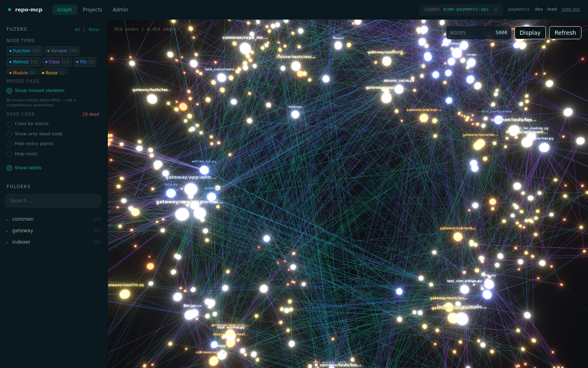
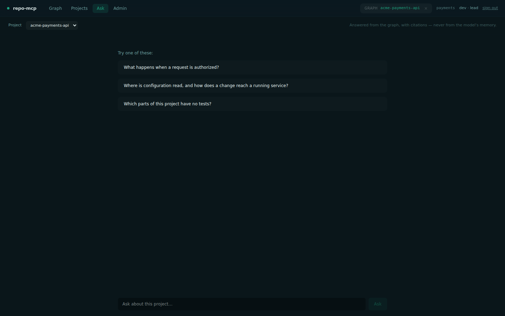
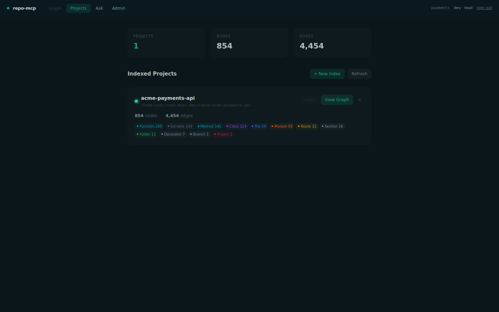
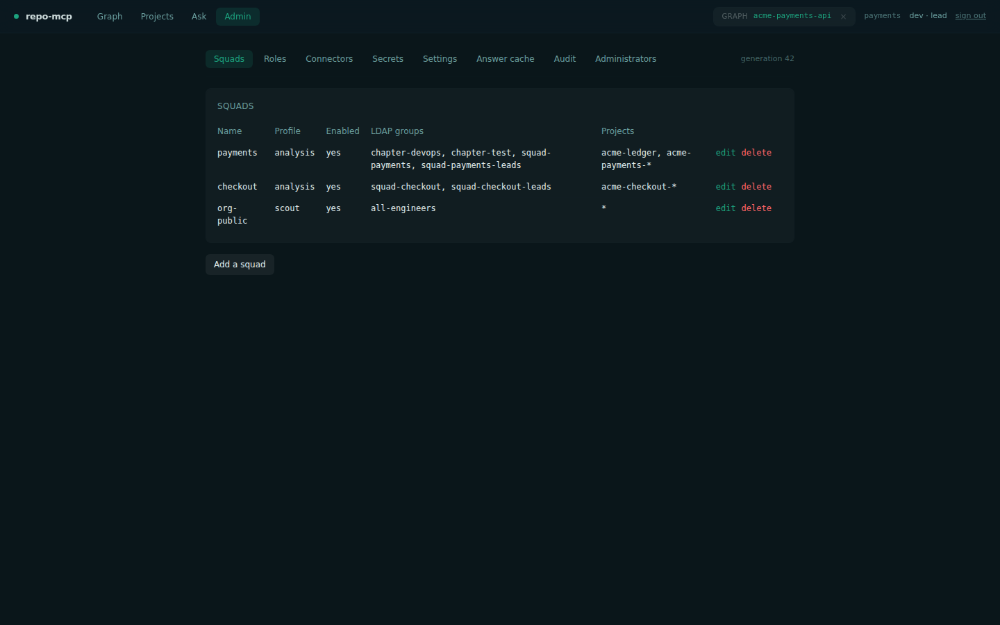
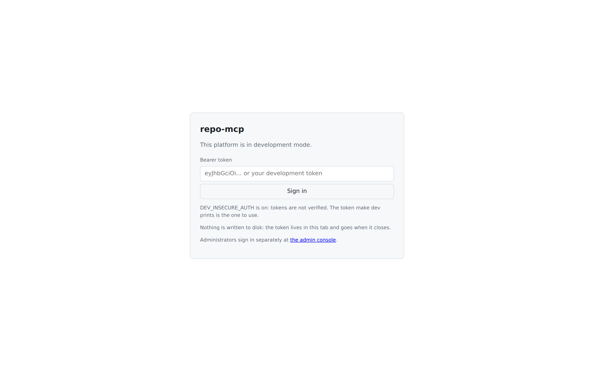

<div align="center">

# repo-mcp

### Bütün repo'larınız, tek bir kod graph'ında.

repo-mcp; GitHub, GitLab ve Bitbucket'taki repo'larınızı merkezî olarak
indeksler ve çıkan kod graph'ını **MCP** üzerinden coding agent'lara,
chatbot'lara ve CI'a açar. Kendi sunucunuzda çalışır, takım bazlı izolasyon
sağlar.

[](LICENSE)
[](CHANGELOG.md)
[](https://github.com/emrezdemir/repo-mcp/actions/workflows/ci.yml)
[](https://www.python.org/)
[](https://modelcontextprotocol.io/)
[](#beş-dakikada-kurulum)
[](https://github.com/emrezdemir/repo-mcp)

**[Site](https://emrezdemir.github.io/repo-mcp/)** ·
**[Belgeler](https://emrezdemir.github.io/repo-mcp/docs/)** ·
[Kurulum](#beş-dakikada-kurulum) ·
[English](README.en.md) ·
[Değişiklikler](CHANGELOG.md)

</div>



---

## Nedir

Çoğu kod indeksleme aracı tek geliştiriciye göre tasarlanmış: herkes aynı
repo'yu kendi makinesinde indeksler, çıkan graph genelde paylaşılmaz, sonuca CI
ya da bir chatbot üzerinden erişmek de pek kolay değildir. repo-mcp bunu bir
ekip için merkezîleştirmeyi amaçlar.

Bir GitHub organizasyonunu, GitLab grubunu veya Bitbucket workspace'ini
**connector** olarak tanımlarsınız; kapsamdaki repo'lar bulunur, klonlanır ve
merkezde indekslenir. Çıkan graph'a **MCP** ile erişilir (HTTP üzerinde
JSON-RPC). Gelen istek bir **OIDC** token'ıyla doğrulanır; kullanıcının **LDAP**
grupları bir role ve bir takıma çevrilir.

## Neden repo-mcp

- **Bir kez indekslenir, herkes kullanır.** Aynı repo herkesin makinesinde
  yeniden indekslenmez. Connector kapsamındaki repo'lar merkezde indekslenir;
  sonradan açılanlar bir sonraki taramada kendiliğinden katılır.
- **Takım bazlı izolasyon.** Her takım kendi kodunu tam ayrıntısıyla, diğer
  takımların servislerini yalnızca topoloji olarak görür. Bunu tek bir ACL
  değil, **üç bağımsız yetki katmanı** güvence altına alır: rolün yetkileri ∩
  takımın proje listesi ∩ motorun tool profili, üstüne takıma özel kök dizin.
- **Graph'tan cevap, tahminden değil.** `ask_codebase` önce deterministik graph
  sorgusunu çalıştırır, modele yalnızca dönen kanıtı yorumlatır ve adı geçen
  sembolleri kaynağıyla gösterir.
- **Restart yok.** Takımlar, roller, connector'lar ve şifreli token'lar
  PostgreSQL'de tutulur. Her değişiklik bir generation sayacını artırır;
  servisler onu izleyip kendini günceller.
- **Tek yönetim yüzeyi değil, iki.** `repo-mcp-admin` terminali ve web konsolu
  aynı fonksiyonları çağırır, aynı doğrulamadan geçer ve aynı audit kaydını
  bırakır. İkisinin ayrışmasını bir test engeller.

## Beş dakikada kurulum

Docker Engine 24+ ve Compose v2 — ya da Podman — yeterli.

```bash
git clone https://github.com/emrezdemir/repo-mcp
cd repo-mcp && make setup     # dört soru -> deploy/.env
make up                       # şema ve servisler; admini /ui'da oluşturursunuz
```

Ardından bir connector tanımlayın — terminalden ya da
`http://localhost:8080/ui` adresindeki konsoldan; ikisi de aynı fonksiyonu
çağırır:

```bash
repo-mcp-admin secret set connector.acme-github.token
repo-mcp-admin connector set acme-github \
  --provider github --squad payments --setting org=acme \
  --token-secret connector.acme-github.token

repo-mcp-admin connector check acme-github
# acme-github: ok — 34 of 41 repositories would be indexed
```

`check`, provider'a sorup connector'ın gerçekten ne göreceğini söyler; bir şey
yanlışsa hangisi olduğunu yazar. Docker'sız geliştirmek için `make dev`.

## Bağlanmak

Kod hakkındaki her soru, çağıranın kendi token'ıyla `POST /mcp` adresine gider:

```bash
curl -s http://localhost:8080/mcp \
  -H "Authorization: Bearer $OIDC_TOKEN" \
  -H "X-Tenant: payments" \
  -d '{"jsonrpc":"2.0","id":1,"method":"tools/list"}'
```

`tools/list` çıktısı çağırana göre değişir: rolün yetkisi olmayan ya da takımın
tool profilinde bulunmayan bir tool listeye girmez.

## Arayüz

<table>
<tr>
<td width="50%"></td>
<td width="50%"></td>
</tr>
<tr>
<td><b>Sorun.</b> Cevap graph'tan gelen kanıta dayanır, adı geçen sembolleri gösterir.</td>
<td><b>Projeler.</b> Takımın indekslediği her şey; sağlığı ve ADR'siyle.</td>
</tr>
<tr>
<td></td>
<td></td>
</tr>
<tr>
<td><b>Yönetin.</b> Takımlar, roller, connector'lar, secret'lar, ayarlar, audit.</td>
<td><b>Girin.</b> PKCE'li Authorization Code; tarayıcı public client.</td>
</tr>
</table>

Arayüz sıfırdan yazılmadı: motorun kendi arayüzü (React + Three.js, MIT) alınıp
bu platforma bağlandı. Gerekçesi
[ADR-0011](docs/adr/0011-adopt-the-upstream-interface.md) içinde.

## Belgeler

Sistemin bütün belgeleri sitede — mimarisi, kurulumu, rolleri, ölçeklenmesi ve
her kararın gerekçesi:
**[emrezdemir.github.io/repo-mcp/docs](https://emrezdemir.github.io/repo-mcp/docs/)**

| Belge | İçerik |
| --- | --- |
| [Mimari](https://emrezdemir.github.io/repo-mcp/docs/architecture/) | İki servis, bir motor, paylaşılan graph dizini |
| [Web arayüzü](https://emrezdemir.github.io/repo-mcp/docs/web-interface/) | Nasıl kurulu, giriş nasıl çalışıyor, ne yapmıyor |
| [Yönetim](https://emrezdemir.github.io/repo-mcp/docs/administration/) | Terminal ve konsol, yan yana |
| [Roller ve yetkiler](https://emrezdemir.github.io/repo-mcp/docs/roles-and-permissions/) | Rol ne yapar, takım neye erişir |
| [Kurulum](https://emrezdemir.github.io/repo-mcp/docs/deployment/) | Compose, Kubernetes, Keycloak ve LDAP |
| [Ölçekleme](https://emrezdemir.github.io/repo-mcp/docs/scaling/) | Replika, kuyruk ve depolama |
| [Kararlar (ADR)](https://emrezdemir.github.io/repo-mcp/docs/adr/0001-wrap-dont-fork/) | Neden fork edilmedi, neden veritabanı, neden bu arayüz |
| [Geliştirme](https://emrezdemir.github.io/repo-mcp/docs/development/) | Yerel kurulum, testler, katkı akışı |

Belgelerin kaynağı [`docs/`](docs/) altındaki markdown dosyaları; site onlardan
üretiliyor, yani iki kopya arasında fark oluşmuyor. Referans belgeleri
İngilizce, tanıtım sayfaları (site ve README) Türkçe.

## Katkı ve güvenlik

Katkı akışı [CONTRIBUTING.md](CONTRIBUTING.md), güvenlik bildirimi
[SECURITY.md](SECURITY.md) içinde. Branch adları `feature/`, `bugfix/`,
`hotfix/`, `chore/` veya `docs/` ile başlar; birleştirmeden önceki kapı
`make verify`.

## Lisans

MIT — [LICENSE](LICENSE). İndeksleme motoru
[codebase-memory-mcp](https://github.com/DeusData/codebase-memory-mcp) (MIT)
sarmalanarak kullanılıyor, fork edilmiyor; ayrıntısı [NOTICE](NOTICE) içinde.
