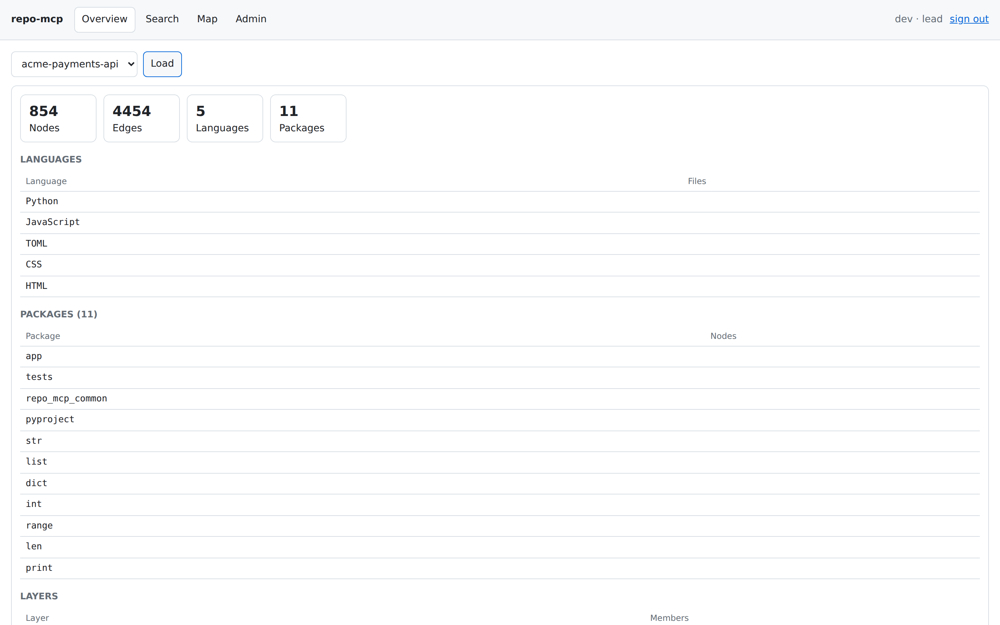
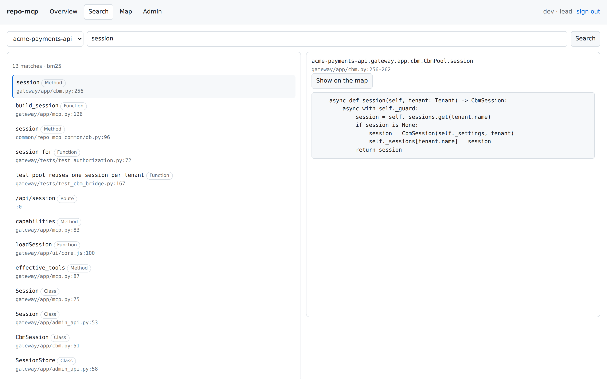

# The web interface

The gateway serves a browser interface at `/ui`. It exists so that the graph
can be looked at by a person, and so that the platform can be configured
without a terminal — not as a second product with its own rules.


## What it is, and what it deliberately is not

Every question the interface asks about a codebase goes to `POST /mcp` as
ordinary JSON-RPC, with the signed-in user's own token. It has no read path of
its own. Anything the browser can do, an MCP client can do, authorized and
audited by exactly the same code.

That is the whole design constraint. A second read API beside the first would
be a second place for the tenancy rules to be wrong, and the two would drift.

Two endpoints exist that MCP has no answer for:

| Endpoint | Answers |
| --- | --- |
| `GET /api/auth` | How to sign in: the redirect flow, the token box, or development mode. Public, because it is answered before anyone is signed in. |
| `GET /api/session` | Who the caller is here: which squad, which role, which tools. Used to decide which buttons to show. |

`/api/session` is a convenience, not a permission. Getting it wrong would show
a button that then fails with a clear refusal — the authorization decision is
made in `mcp.py`, on the request, every time.

The administrative console is the exception: it talks to `/admin/*`, the same
routes `repo-mcp-admin` uses, with a separate local session. See
[administration.md](administration.md).

## Signing in

The screen matches the deployment, because it asks the platform what the
deployment is rather than assuming at build time.


**Through the identity provider.** When `oidc.issuer` and
`oidc.browser_client_id` are both set, the interface runs Authorization Code
with PKCE:

1. It fetches `<issuer>/.well-known/openid-configuration` to find the
   authorization and token endpoints.
2. It generates a verifier, stores it in `sessionStorage`, and redirects to
   the provider with the SHA-256 challenge.
3. The provider authenticates the person and redirects back to `/ui` with a
   code.
4. The interface exchanges the code, sending the verifier, and receives an
   access token.

There is no client secret; a public client cannot keep one, and PKCE is what
replaces it. The gateway is not in the flow at any point — it verifies the
resulting token on `/mcp` exactly as it verifies an MCP client's.

**With a token.** Without a browser client the token box remains, and it stays
available alongside the redirect. Pasting the token an MCP client is using is
the quickest way to find out why that client is being refused.

**In development.** `DEV_INSECURE_AUTH` accepts one static token and verifies
nothing. The sign-in screen says so, in those words. A screen that looked the
same as a real one would be actively misleading.

### What is stored, and where

The access token, the refresh token and the expiry go in `sessionStorage` and
nowhere else — not `localStorage`, not a cookie. Closing the tab ends the
session, and nothing is written to disk. An expiring token is renewed just
before the request that would otherwise have failed, so a session in use does
not expire under someone.

### Registering the client

The bundled Keycloak already has one. `deploy/keycloak/repo-mcp-realm.json` is
imported on first start and carries a `repo-mcp-web` public client with PKCE,
the group and audience mappers, and the groups the example squads refer to.
Create a user and point the platform at it:

```bash
scripts/keycloak-user.sh ada --name "Ada Lovelace" --group squad-payments
repo-mcp-admin set oidc.issuer http://localhost:8081/realms/repo-mcp
repo-mcp-admin set oidc.browser_client_id repo-mcp-web
```

For an existing Keycloak, a client for the interface needs:

| Setting | Value |
| --- | --- |
| Client ID | whatever you set `oidc.browser_client_id` to, for example `repo-mcp-web` |
| Client authentication | off — this is a public client |
| Standard flow | on |
| Direct access grants | off |
| Valid redirect URIs | `https://repo-mcp.example.com/ui` |
| Web origins | `https://repo-mcp.example.com` |
| Proof Key for Code Exchange | `S256` |

The group membership claim has to reach the token under the name
`oidc.groups_claim` expects (`groups` by default). Keycloak renders groups as
`/squad-payments`; the gateway strips the leading slash.

Then, from a terminal or from the console:

```bash
repo-mcp-admin set oidc.browser_client_id repo-mcp-web
```

Web origins is the setting people miss. Without it the browser's request to
the token endpoint is refused by CORS, and the sign-in fails after the
redirect rather than before it.

## The pages

### Overview

`get_architecture` for the selected project: node and edge counts, languages,
packages, hotspots, boundaries, layers.



### Search

`search_graph` by name, and `get_code_snippet` for whichever result is
selected. A result can be sent to the map, which draws the graph if it is not
drawn and moves the camera to that symbol.



A role without `READ_SOURCE` gets the results and not the source. The
interface does not hide the button on a guess — it asks `/api/session` — but
the refusal comes from the gateway either way.

### Map

`query_graph` for every edge in the project, drawn with WebGL.

The rendering is Sigma over graphology. A real codebase graph is tens of
thousands of nodes and edges, which is past the point where Canvas 2D and the
SVG-based graph libraries stop being usable: one draw call class for all nodes
and one for all edges, with the GPU doing the work, is what makes that
tractable at all.

The ForceAtlas2 layout runs in a Web Worker, so the main thread only draws and
the graph can be panned and zoomed while it is still settling. A deployment
whose content security policy forbids `worker-src blob:` falls back to slicing
the same layout between frames on the main thread — slower and less smooth,
but not broken.

Filtering by node label and edge type happens in the render reducers rather
than by removing anything from the model, so a filter is instant, reversible,
and never moves the layout.

The request is capped at 60 000 edges. The cap is reported in the status line
when it bites: a partial graph that says so is useful, and one that does not
is misleading.

The map needs the `QUERY_RAW` capability. A role without it gets a sentence
explaining that, not an empty canvas.

### Admin

The administrative console. Documented in
[administration.md](administration.md).


## How it is built

No build step, no bundler, no Node toolchain in this repository.

- The interface's own code is native ES modules. The browser resolves the
  imports, so the code is split into real files with explicit dependencies and
  there is still nothing to compile.
- The three browser libraries are committed under
  `gateway/app/ui/vendor/` as pre-built UMD bundles. `scripts/update-vendor.sh`
  reports the pinned and latest versions, downloads and verifies against
  `checksums.txt`, and is what keeps "committed" from meaning "forgotten".
- Nothing is fetched from a CDN, so an air-gapped installation works.

```
gateway/app/ui/
├── index.html
├── style.css
├── core.js            shared state, DOM helpers, the calls to /mcp
├── auth.js            the OIDC flow
├── graph.js           the WebGL renderer and the layout
├── pages/
│   ├── overview.js  search.js  map.js  admin.js
│   └── admin/       squads.js roles.js connectors.js secrets.js
│                    settings.js cache.js audit.js accounts.js
└── vendor/            sigma, graphology, graphology-library
```

Files under `ui/` are served without authentication — the sign-in screen
cannot require having signed in, and nothing there reveals anything about a
codebase. The route resolves the requested path and refuses anything that
lands outside the directory.

## Regenerating the screenshots

`scripts/ui-screenshots.py` drives the running interface and writes
`docs/images/ui-*.png`. Playwright is not a dependency of this project —
adding a Node toolchain for pictures would be a poor trade — so install it
when you need to:

```bash
pip install playwright && playwright install chromium
scripts/dev.sh gateway
python3 scripts/ui-screenshots.py --project <an-indexed-project>
```

## What is not there yet

- **No writes to a codebase.** The interface reads. Triggering an index, or
  writing an ADR, is a tool call an MCP client can make and this cannot.
- **No graph history.** The map shows the graph as it is now. Comparing two
  points in time is [ADR-0004](adr/0004-graph-history.md) and unbuilt.
- **No saved views.** A filter selection and a camera position last as long as
  the page does.
